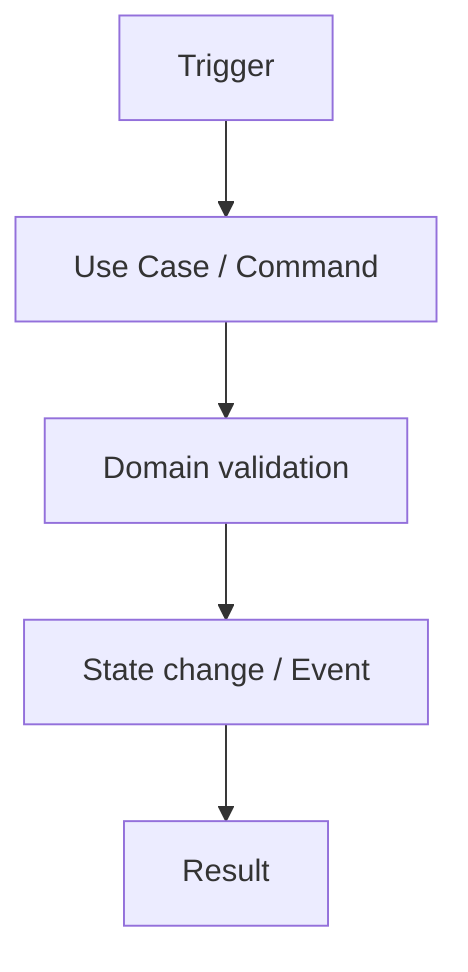

# {{title}}

## Business goal

Опишіть measurable business outcome.

## Actors

- actor;

## Trigger / input

Опишіть початкову подію або запит.

## Workflow



Diagram має показувати meaningful business sequence, а не копіювати назви всіх класів.

## Decision points

Опишіть meaningful decisions.

## Events

Дайте links на generated event reference замість ручного дублювання exact strings.

## Failure paths

Опишіть expected failures, retries/idempotency і denied paths.

## Invariants

Зафіксуйте правила, які не можна порушити.

## UI surfaces

Покажіть delivery surfaces без перенесення business ownership у UI.

## Code map

```text
app/Domains/...
```
