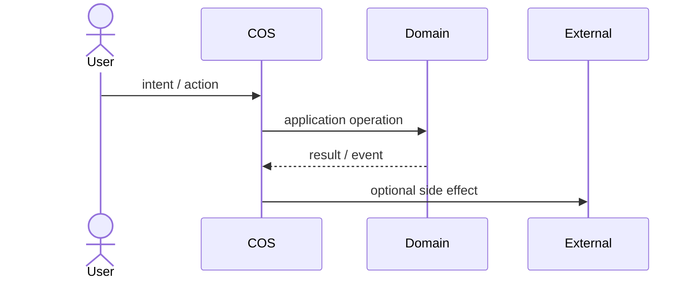
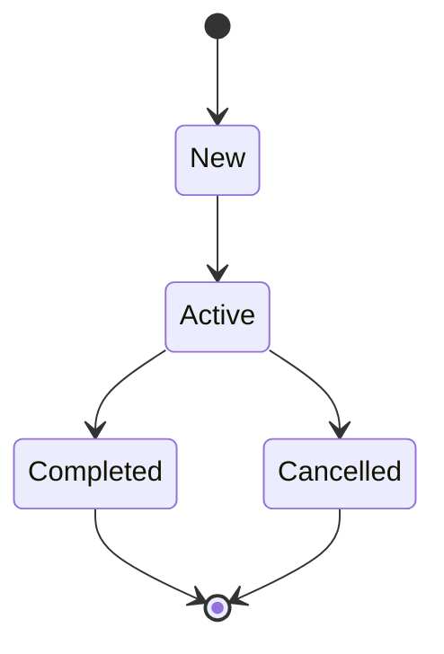
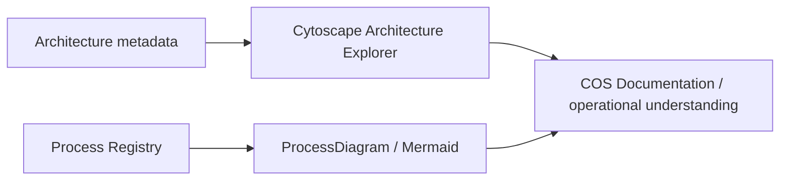

# Business Process Modeling

COS documentation treats a business process as an operational model, not as decorative documentation. Starting with DOC V0.12, the canonical flow topology lives in the **Process Registry** and Mermaid is a derived visual projection of that structured definition. DOC V0.13 adds explicit step ownership and structural coverage.

## Source-of-truth chain

```text
Business meaning / Domain ownership
        ↓
Process Registry definition
steps + owners + edges + criticality + runtime mappings
        ↓
ProcessDiagram
        ↓
Core flow / ownership view
        ↓
Mermaid in VitePress
```

A workflow page remains the human narrative around the process, but it no longer manually duplicates the same core `steps`, `owners` and `edges` in diagrams.

## Truth states

Every canonical workflow page declares `process_state`, and the matching registry definition declares the same `state`.

| State | Meaning |
| --- | --- |
| `as-is` | Реальний поточний бізнес-процес, підтверджений current code, tests, manifests або фактичною operational procedure. Не кожен human step мусить бути executable у COS. |
| `to-be` | Цільовий процес, який ще не можна читати як поточну поведінку системи. |
| `runtime-verified` | Критичні transitions мають explicit executable mapping до use cases, commands, events, policies або source symbols current `main`. |

`active` у полі `status` означає стан документа. `process_state` означає стан самого бізнес-процесу. Це різні речі.

## Process Registry contract

Кожен `workflow-v2` має matching JSON definition у `docs/.vitepress/processes/`.

Schema `v2` фіксує:

- stable `id`;
- owning Domain;
- trigger і outcomes;
- actors;
- process concepts через `steps`;
- рівно одного responsible `owner` для кожного step;
- topology через `edges`;
- `critical` transitions;
- runtime mappings до generated reference або exact source symbols.

`owner` мусить бути одним з actors цього process. Actor може бути людиною, роллю, deterministic engine, automation boundary або adapter, якщо саме він реально відповідає за step. Actor не отримує ownership лише тому, що десь бере участь у процесі.

Workflow page фіксує той самий `process_id` і рендерить дві derived projections:

```html
<ProcessDiagram process-id="domain.process-id" />
<ProcessDiagram process-id="domain.process-id" view="ownership" direction="LR" />
```

`check-processes.mjs` перевіряє відповідність title/state/id, runtime mappings, owner → actors, edge targets, root/terminal topology, reachability усіх steps і наявність обох process projections.

## Canonical views

Один процес може мати кілька проєкцій, якщо вони відповідають на різні питання.

### Core business flow

Core flow показує **що за чим відбувається** і генерується тільки з Process Registry.

```text
Registry steps + edges → ProcessDiagram(flow) → Mermaid
```

### Ownership view

Ownership view показує **хто відповідає за кожний step**. Він використовує ті самі nodes та edges, але групує їх у actor lanes.

```text
Registry actors + step.owner + edges
        ↓
ProcessDiagram(ownership)
        ↓
Mermaid subgraphs / lanes
```

Це не RACI matrix. `owner` означає primary responsible actor конкретного process step. Consulted/informed roles, approvals і delegation можуть отримати окрему governance projection пізніше, якщо це справді потрібно.

### Interaction sequence

Sequence diagram може залишатися human-maintained, якщо він показує interaction semantics, яких немає в core topology.



### State lifecycle

State diagram може залишатися окремою проєкцією lifecycle однієї domain concept/entity.



## Coverage

Generated [Business Process Registry](../12-reference/business-processes.md) рахує три structural coverage ratios:

- **Ownership coverage** — скільки steps мають valid owner;
- **Runtime mapping coverage** — скільки steps мають хоча б один executable/reference mapping;
- **Critical runtime coverage** — скільки critical steps мають mapping.

Це не оцінка ефективності бізнесу і не KPI процесу. `8/8 runtime mapped` означає лише, що документація може простежити кожний step до executable/reference layer. Воно нічого не каже про швидкість, конверсію чи здоровий глузд самого процесу.

## Modeling rules

1. Core process topology редагується в registry definition, а не одночасно в JSON і Mermaid.
2. Кожний step має одного primary responsible `owner` з declared actors.
3. Process починається з root step і має хоча б один terminal step.
4. Усі steps мають бути reachable від root; orphan steps є documentation defect.
5. Human steps показуються нарівні з automated steps, якщо вони реально є частиною процесу.
6. Domain decisions відділяються від UI clicks і transport details.
7. Cross-domain transition має називати boundary або contract, а не малювати shared ownership.
8. Exact command/event inventories не дублюються вручну, якщо для них існує generated reference.
9. `runtime-verified` не використовується лише тому, що частина процесу має код.
10. Supplemental Mermaid diagrams дозволені лише коли вони показують іншу проєкцію: sequence, lifecycle, automation loop, intake detail тощо.

## Mermaid delivery

VitePress перетворює fenced blocks `mermaid` на docs-layer `MermaidDiagram`. `ProcessDiagram` використовує той самий renderer, але будує Mermaid source напряму з matching Process Registry definition.

`view="flow"` створює canonical topology. `view="ownership"` групує ті самі steps за responsible actor. Обидва views походять з одного definition, тому зміна owner або edge не вимагає ручного перемальовування схем.

Renderer завантажує pinned Mermaid `11.17.2`, використовує `securityLevel: strict` і перемальовує diagram при зміні light/dark theme.

Mermaid є presentation adapter документації. Він не входить у `Kernel\\Visualization` і не стає source of truth для runtime architecture.

Якщо browser runtime не може завантажити renderer, сторінка показує вихідний Mermaid source замість порожнього блоку.

## Relationship to Architecture Explorer



Cytoscape відповідає переважно на питання **«з чого COS складається і як компоненти пов'язані?»**. Process Registry + Mermaid відповідають на питання **«як реально рухається робота, хто за неї відповідає і які runtime contracts це підтримують?»**.

## Change discipline

Зміна canonical business flow або ownership має починатися зі зміни registry definition. Після цього `docs:check` перевіряє topology, ownership і executable mappings, generated reference оновлює coverage, а VitePress автоматично показує обидві нові схеми.

Це прибирає класичний документаційний антипатерн: код уже живе в одному світі, відповідальні люди в другому, а намальована схема ще пам'ятає молодість автора.
