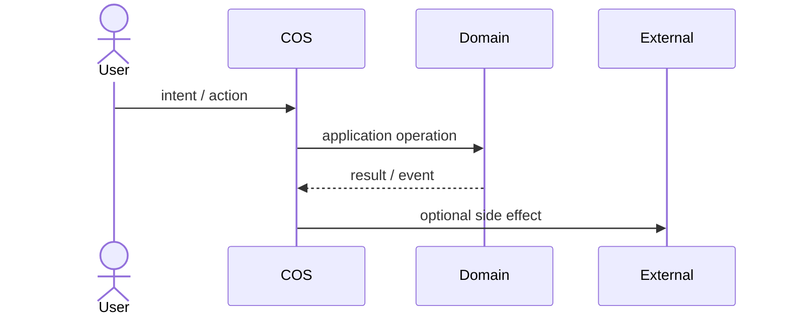
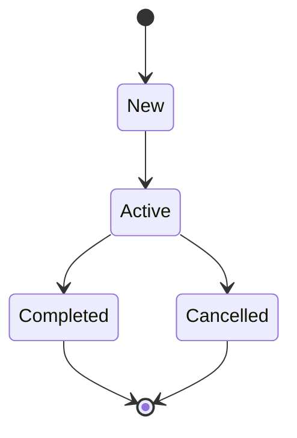
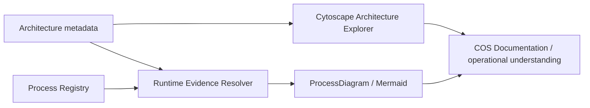

# Business Process Modeling

COS documentation treats a business process as an operational model, not as decorative documentation. The canonical flow topology lives in the **Process Registry** and Mermaid is a derived visual projection of that structured definition. Visualization V0.5 separates business truth from runtime evidence so a process can no longer self-declare that it is verified.

## Source-of-truth chain

```text
Business meaning / Domain ownership
        ↓
Process Registry definition
steps + owners + edges + criticality + runtime mappings
        ↓
Runtime Evidence Resolver
current source + event catalogues + cross-domain contracts
        ↓
Derived verification
DOCUMENTED / SOURCE-VERIFIED / RUNTIME-VERIFIED
        ↓
ProcessDiagram + generated reference
        ↓
Mermaid in VitePress
```

A workflow page remains the human narrative around the process, but it does not manually duplicate the same core `steps`, `owners`, `edges` or verification claim.

## Two independent dimensions

Business state and verification answer different questions and must not share one enum.

### Business state

Every canonical workflow page declares `process_state`, and the matching registry definition declares the same `state`.

| State | Meaning |
| --- | --- |
| `as-is` | Реальний поточний бізнес-процес. Він може містити manual steps і не зобов'язаний бути повністю automated. |
| `to-be` | Цільовий процес, який ще не можна читати як поточну поведінку компанії або COS. |

`active` у полі `status` означає стан документа. `process_state` означає стан самого бізнес-процесу. Це різні речі.

### Derived verification

Verification не записується в process JSON. Її рахує evidence resolver для current checkout.

| Verification | Meaning |
| --- | --- |
| `documented` | Process topology існує, але хоча б один critical step не має resolvable current-checkout evidence. |
| `source-verified` | Кожен critical step має хоча б один mapping, підтверджений існуючим source/use case/command. |
| `runtime-verified` | Кожен critical step має хоча б один mapping до canonical runtime/contract registry. |

`runtime-verified` у V0.5 означає **structural runtime verification**, а не observed production execution. Реальний execution trace є сильнішим класом доказу і має з'явитися окремим runtime-observability layer, а не бути вигаданим документацією.

## Process Registry contract

Кожен `workflow-v2` має matching JSON definition у `docs/.vitepress/processes/`.

Schema `v3` фіксує:

- stable `id`;
- owning Domain;
- business `state` (`as-is` або `to-be`);
- trigger і outcomes;
- actors;
- process concepts через `steps`;
- рівно одного responsible `owner` для кожного step;
- topology через `edges`;
- `critical` transitions;
- runtime/evidence mappings.

Schema v3 навмисно не має authored `verification`. Якщо таке поле з'явиться, `docs:check` падає.

`owner` мусить бути одним з actors цього process. Actor може бути людиною, роллю, deterministic engine, automation boundary або adapter, якщо саме він реально відповідає за step.

Workflow page фіксує той самий `process_id` і рендерить дві derived projections:

```html
<ProcessDiagram process-id="domain.process-id" />
<ProcessDiagram process-id="domain.process-id" view="ownership" direction="LR" />
```

## Runtime evidence catalogue

`generate-runtime-evidence.php` будує machine-readable catalogue напряму з current checkout.

Поточні evidence types:

| Mapping | Authority | Verification strength |
| --- | --- | --- |
| `use_case` | registered Domain `Application/UseCase/*.php` | source |
| `command` | registered Domain `Application/DTO/*Command.php` | source |
| `source` | exact repository file + optional symbol | source |
| `event` | explicit Domain event catalogue | runtime |
| `contract` | canonical `cross_domain_contracts` declaration | runtime |

Generated Markdown не є доказом для іншого generated Markdown. `check-processes.mjs` і Business Process reference споживають той самий evidence catalogue, а reference pages залишаються лише представленням.

## Canonical views

Один процес може мати кілька проєкцій, якщо вони відповідають на різні питання.

### Core business flow

```text
Registry steps + edges → ProcessDiagram(flow) → Mermaid
```

Core flow показує **що за чим відбувається**.

### Ownership view

```text
Registry actors + step.owner + edges
        ↓
ProcessDiagram(ownership)
        ↓
Mermaid subgraphs / lanes
```

Ownership view показує **хто відповідає за кожний step**. Це не RACI matrix, а primary ownership.

### Interaction sequence

Sequence diagram не можна чесно вивести лише з generic `steps + edges`. Для нього потрібна окрема семантика interaction participants/messages. До появи такої structured projection sequence diagram може бути supplemental Mermaid, але не називатися canonical derived view.



### State lifecycle

State diagram так само потребує canonical entity state-machine semantics. Business process step не дорівнює entity state лише тому, що слово схоже.



## Coverage

Generated [Business Process Registry](../12-reference/business-processes.md) показує окремо:

- **Ownership coverage**;
- **Mapped steps**;
- **Evidence-verified steps**;
- **Runtime-backed steps**;
- **Critical source verification**;
- **Critical runtime verification**.

Це coverage документації/evidence, а не KPI бізнесу. `8/8 verified` нічого не говорить про conversion, latency або те, чи процес взагалі добре придуманий.

## Modeling rules

1. Core process topology редагується в registry definition, а не одночасно в JSON і Mermaid.
2. Кожний step має одного primary responsible `owner` з declared actors.
3. `state` містить лише business truth: `as-is` або `to-be`.
4. Verification ніколи не авториться вручну.
5. Process починається з root step і має хоча б один terminal step.
6. Усі steps мають бути reachable від root; orphan steps є documentation defect.
7. Human steps показуються нарівні з automated steps, якщо вони реально є частиною процесу.
8. Domain decisions відділяються від UI clicks і transport details.
9. Cross-domain transition має називати boundary або contract, а не малювати shared ownership.
10. Exact command/event inventories не дублюються вручну, якщо для них існує canonical evidence catalogue.
11. Sequence/state projections не генеруються з недостатньої семантики тільки заради красивої картинки.

## Mermaid delivery

VitePress перетворює fenced blocks `mermaid` на docs-layer `MermaidDiagram`. `ProcessDiagram` використовує той самий renderer, але будує Mermaid source напряму з matching Process Registry definition.

`view="flow"` створює canonical topology. `view="ownership"` групує ті самі steps за responsible actor. Mermaid є presentation adapter документації. Він не входить у `Kernel\\Visualization` і не стає source of truth для runtime architecture.

## Relationship to Architecture Explorer



Cytoscape відповідає на питання **«з чого COS складається і як компоненти пов'язані?»**. Process Registry + evidence + Mermaid відповідають **«як рухається робота, хто за неї відповідає і наскільки ці твердження підтверджені current runtime architecture?»**.

## Change discipline

Зміна canonical business flow або ownership починається зі зміни registry definition. Зміна runtime implementation автоматично впливає на evidence verification. `docs:check` перевіряє topology, ownership та evidence mappings, generated reference оновлює coverage, а VitePress показує derived diagrams.

Так схема перестає бути красивою легендою про систему, яка існувала три рефакторинги тому.
