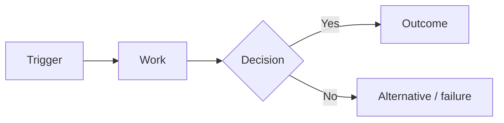
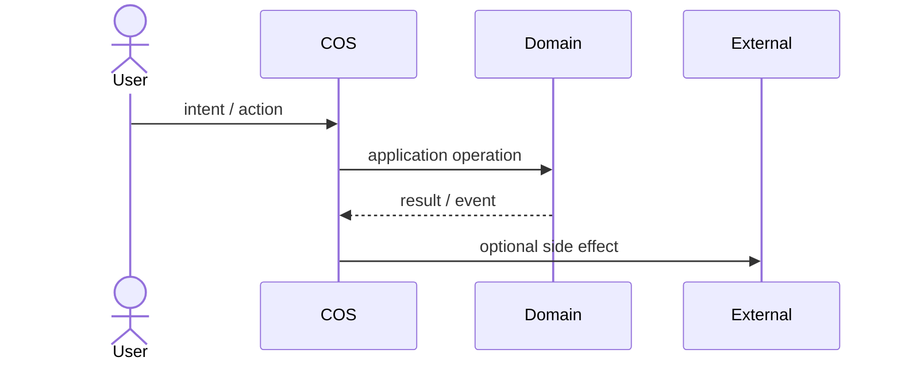
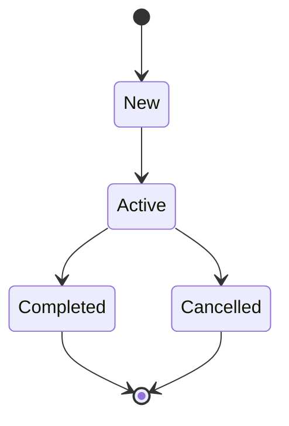
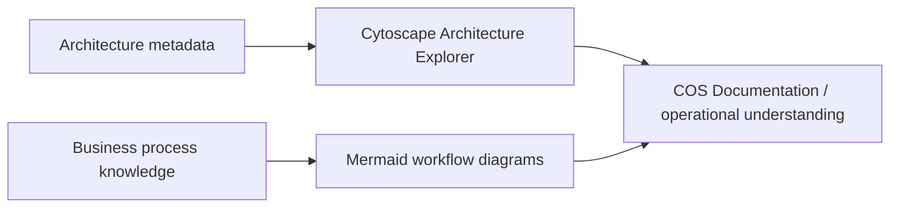

# Business Process Modeling

COS documentation treats a business process as an operational model, not as decorative documentation. Mermaid is the visual renderer; the business meaning remains owned by the relevant Domain and current `main` behavior.

## Truth states

Every canonical workflow page declares `process_state`.

| State | Meaning |
| --- | --- |
| `as-is` | Реальний поточний бізнес-процес, підтверджений current code, tests, manifests або фактичною operational procedure. Не кожен human step мусить бути executable у COS. |
| `to-be` | Цільовий процес, який ще не можна читати як поточну поведінку системи. |
| `runtime-verified` | Критичні transitions мають explicit executable mapping до use cases, commands, events, policies або generated reference поточного `main`. |

`active` у полі `status` означає стан документа. `process_state` означає стан самого бізнес-процесу. Це різні речі.

## Canonical views

Один процес може мати кілька проєкцій, якщо вони відповідають на різні питання.

### Business flow

Показує, як робота рухається від trigger до business outcome.

### Interaction sequence

Показує взаємодію actor, COS, Domain та external system без перенесення business ownership у delivery layer.

### State lifecycle

Показує lifecycle однієї domain concept/entity. State diagram не повинен підміняти business flow, якщо процес охоплює кілька сутностей та actors.

## Modeling rules

1. Diagram починається з business trigger і закінчується business outcome або explicit failure/alternative path.
2. Human steps показуються нарівні з automated steps, якщо вони реально є частиною процесу.
3. Domain decisions відділяються від UI clicks і transport details.
4. Cross-domain transition має називати boundary або contract, а не малювати shared ownership.
5. Exact command/event/service inventories не дублюються вручну, якщо для них існує generated reference.
6. `runtime-verified` не використовується лише тому, що частина процесу має код.
7. Mermaid source зберігається поруч із narrative workflow, щоб diff показував зміну процесу разом зі зміною пояснення.

## Mermaid delivery

VitePress перетворює fenced blocks `mermaid` на docs-layer `MermaidDiagram`. Renderer завантажує pinned Mermaid `11.17.2`, використовує `securityLevel: strict` і перемальовує diagram при зміні light/dark theme.

Mermaid є presentation adapter документації. Він не входить у `Kernel\\Visualization` і не стає source of truth для runtime architecture.

Якщо browser runtime не може завантажити renderer, сторінка показує вихідний Mermaid source замість порожнього блоку.

## Relationship to Architecture Explorer

Cytoscape відповідає переважно на питання **«з чого COS складається і як компоненти пов'язані?»**. Mermaid відповідає на питання **«як реально рухається робота?»**.

Наступний рівень розвитку — структуровані process definitions, з яких документація зможе генерувати Mermaid і перевіряти runtime mapping автоматично. До появи такого source of truth workflow page залишається canonical human-maintained process model із явним `process_state`.
