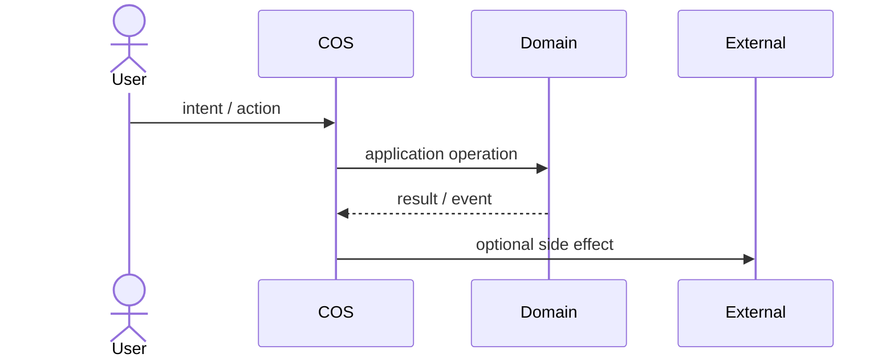
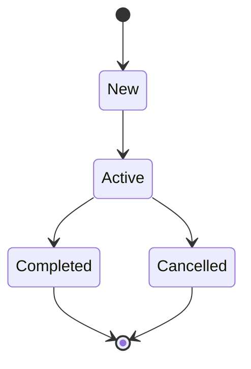
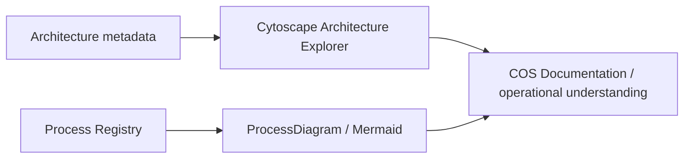

# Business Process Modeling

COS documentation treats a business process as an operational model, not as decorative documentation. Starting with DOC V0.12, the canonical flow topology lives in the **Process Registry** and Mermaid is a derived visual projection of that structured definition.

## Source-of-truth chain

```text
Business meaning / Domain ownership
        ↓
Process Registry definition
steps + edges + criticality + runtime mappings
        ↓
ProcessDiagram
        ↓
Mermaid flowchart in VitePress
```

A workflow page remains the human narrative around the process, but it no longer manually duplicates the same core `steps` and `edges` in Mermaid.

## Truth states

Every canonical workflow page declares `process_state`, and the matching registry definition declares the same `state`.

| State | Meaning |
| --- | --- |
| `as-is` | Реальний поточний бізнес-процес, підтверджений current code, tests, manifests або фактичною operational procedure. Не кожен human step мусить бути executable у COS. |
| `to-be` | Цільовий процес, який ще не можна читати як поточну поведінку системи. |
| `runtime-verified` | Критичні transitions мають explicit executable mapping до use cases, commands, events, policies або source symbols current `main`. |

`active` у полі `status` означає стан документа. `process_state` означає стан самого бізнес-процесу. Це різні речі.

## Process Registry contract

Кожен `workflow-v2` має matching JSON definition у `docs/.vitepress/processes/`.

Definition фіксує:

- stable `id`;
- owning Domain;
- trigger і outcomes;
- actors;
- ordered process concepts через `steps`;
- topology через `edges`;
- `critical` transitions;
- runtime mappings до generated reference або exact source symbols.

Workflow page фіксує той самий `process_id` і рендерить:

```html
<ProcessDiagram process-id="domain.process-id" />
```

`check-processes.mjs` перевіряє відповідність title/state/id, runtime mappings, edge targets, root/terminal topology, reachability усіх steps і наявність правильного `ProcessDiagram`.

## Canonical views

Один процес може мати кілька проєкцій, якщо вони відповідають на різні питання.

### Core business flow

Core flow генерується тільки з Process Registry.

```text
Registry steps + edges → ProcessDiagram → Mermaid
```

### Interaction sequence

Sequence diagram може залишатися human-maintained, якщо він показує interaction semantics, яких немає в core topology.



### State lifecycle

State diagram може залишатися окремою проєкцією lifecycle однієї domain concept/entity.



## Modeling rules

1. Core process topology редагується в registry definition, а не одночасно в JSON і Mermaid.
2. Process починається з root step і має хоча б один terminal step.
3. Усі steps мають бути reachable від root; orphan steps є documentation defect.
4. Human steps показуються нарівні з automated steps, якщо вони реально є частиною процесу.
5. Domain decisions відділяються від UI clicks і transport details.
6. Cross-domain transition має називати boundary або contract, а не малювати shared ownership.
7. Exact command/event inventories не дублюються вручну, якщо для них існує generated reference.
8. `runtime-verified` не використовується лише тому, що частина процесу має код.
9. Supplemental Mermaid diagrams дозволені лише коли вони показують іншу проєкцію: sequence, lifecycle, automation loop, intake detail тощо.

## Mermaid delivery

VitePress перетворює fenced blocks `mermaid` на docs-layer `MermaidDiagram`. `ProcessDiagram` використовує той самий renderer, але будує Mermaid source напряму з matching Process Registry definition.

Renderer завантажує pinned Mermaid `11.17.2`, використовує `securityLevel: strict` і перемальовує diagram при зміні light/dark theme.

Mermaid є presentation adapter документації. Він не входить у `Kernel\\Visualization` і не стає source of truth для runtime architecture.

Якщо browser runtime не може завантажити renderer, сторінка показує вихідний Mermaid source замість порожнього блоку.

## Relationship to Architecture Explorer



Cytoscape відповідає переважно на питання **«з чого COS складається і як компоненти пов'язані?»**. Process Registry + Mermaid відповідають на питання **«як реально рухається робота і які runtime contracts це підтримують?»**.

## Change discipline

Зміна canonical business flow має починатися зі зміни registry definition. Після цього `docs:check` перевіряє topology і executable mappings, а VitePress автоматично показує нову схему.

Це прибирає класичний документаційний антипатерн: код уже живе в одному світі, JSON у другому, а намальована схема ще пам'ятає молодість автора.
