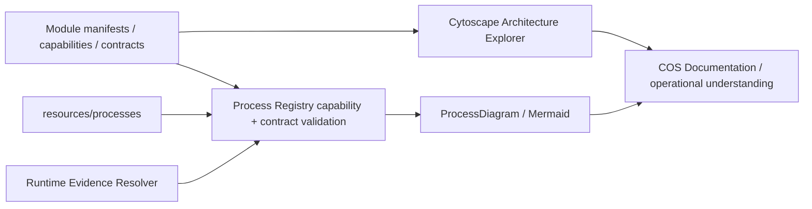

# Моделювання бізнес-процесів

COS розглядає бізнес-процес як **операційну модель системи**, а не як декоративну діаграму в документації.

Канонічна topology (топологія) процесу живе в **Process Registry**, а Mermaid та інші візуальні представлення є похідними проєкціями.

## Ланцюжок джерел правди

```text
Бізнесовий зміст
        ↓
Process Registry definition
resources/processes/*.json
steps + owners + domain + capability/gap + edges + criticality + runtime mappings
        ↓                         ↓
Module capability authority      Runtime Evidence Resolver
app/Domains/*/module.php         current source + events + contracts
        ↓                         ↓
Capability coverage              Derived verification
        └──────────────┬──────────┘
                       ↓
              ProcessDiagram + Reference
                       ↓
                 Mermaid / VitePress
```

Workflow page залишається людським поясненням процесу, але не дублює вручну його core topology, ownership, capability claims або verification claims.

## Три незалежні виміри

### 1. Бізнесовий стан процесу

Кожна канонічна workflow page має `process_state`, а відповідне визначення Process Registry — поле `state` із тим самим значенням.

| Стан | Значення |
| --- | --- |
| `as-is` | Реальний поточний бізнес-процес. Він може містити ручні кроки й не зобов’язаний бути повністю автоматизованим. |
| `to-be` | Цільова модель, яку ще не можна читати як поточну поведінку компанії або COS. |

`status` описує стан документа. `process_state` описує стан бізнес-процесу.

### 2. Покриття можливостями

Кожний step (крок) має явний `domain` і одне з двох:

```json
{
  "domain": "property",
  "capability": "property.inventory"
}
```

або чесно зафіксовану прогалину:

```json
{
  "domain": "sales",
  "capability": null,
  "capability_gap": "missing-domain-capability"
}
```

Capability вважається канонічною лише тоді, коли її оголошено в module contribution `app/Domains/*/module.php`.

`check-processes.mjs` перевіряє це через evidence catalogue поточного checkout, а не через згенерований Markdown.

Capability gap не означає, що крок не реалізований. Він означає, що словник можливостей Domain ще не описує цю бізнес-операцію достатньо точно.

### 3. Похідна перевірка

Verification не записується вручну в process JSON. Її обчислює evidence resolver для поточного checkout.

| Рівень | Значення |
| --- | --- |
| `documented` | Топологія існує, але хоча б один critical step не має підтверджуваного evidence в поточному checkout. |
| `source-verified` | Кожний critical step має хоча б один mapping, підтверджений source, Use Case або Command. |
| `runtime-verified` | Кожний critical step має хоча б один mapping до канонічного runtime або contract registry. |

`runtime-verified` означає структурну перевірку runtime, а не спостережуваний production trace.

## Контракт Process Registry

Кожний `workflow-v2` має відповідне JSON-визначення в `resources/processes/`.

Schema `v4` залишається валідною для same-domain workflows. Schema `v5` додає cross-domain steps, захищені контрактами.

Process definition фіксує:

- стабільний `id`;
- Domain процесу;
- бізнесовий `state` (`as-is` або `to-be`);
- trigger та outcomes;
- actors;
- steps;
- primary `owner` кожного step;
- `domain` кожного step;
- canonical `capability` або explicit `capability_gap`;
- topology через `edges`;
- `critical` transitions;
- runtime/evidence mappings.

Поле `verification`, задане автором, заборонене в усіх версіях schema.

### Cross-domain step у schema v5

Process залишається власністю одного root Domain, але окремий step може використовувати capability іншого Domain.

Такий перехід не можна просто оголосити текстом:

```json
{
  "id": "resolve-property",
  "domain": "property",
  "capability": "property.reference",
  "runtime": [
    {
      "type": "contract",
      "ref": "Domains\\Property\\Contract\\PropertyReferencePort"
    }
  ]
}
```

Checker дозволяє цей step лише тоді, коли module evidence поточного checkout доводить, що Process Domain декларує цей contract із `role: requires`, а `counterpart` дорівнює Domain кроку.

Для `sales.request-to-property-match`:

```text
Sales process
  ↓ requires PropertyReferencePort
Property / property.reference
  ↓
Sales Property Match
```

Cross-domain execution не створює shared ownership. Property step використовує Property capability; Sales продовжує володіти процесом, Client Case і relationship Property Match.

## Канонічні представлення

Кожна workflow page рендерить три базові проєкції, а cross-domain workflow додатково показує Domain projection:

```html
<ProcessDiagram process-id="domain.process-id" />
<ProcessDiagram process-id="domain.process-id" view="ownership" direction="LR" />
<ProcessDiagram process-id="domain.process-id" view="capability" direction="LR" />
<ProcessDiagram process-id="domain.process-id" view="domain" direction="LR" />
```

### Основний бізнес-потік

`ProcessDiagram(flow)` відповідає на питання **що за чим відбувається**.

### Представлення відповідальності

`ProcessDiagram(ownership)` групує steps за primary responsible actor і відповідає на питання **хто відповідає**.

### Представлення можливостей

`ProcessDiagram(capability)` групує ті самі steps за canonical capability. Steps без semantic Domain capability показуються як явний `GAP`.

Ця проєкція відповідає на питання **яку здатність Domain реалізує цим кроком і де capability model ще неповна**.

### Представлення доменів

`ProcessDiagram(domain)` групує steps за їхнім фактичним Domain. Для cross-domain workflow воно показує Domain hop із тієї самої topology без другої ручної Mermaid-схеми.

### Sequence та state diagrams

Sequence/state diagrams не можна чесно вивести лише з generic `steps + edges`.

До появи структурованої interaction/state semantics вони можуть бути додатковими Mermaid-діаграмами, але не канонічними derived projections.

## Каталог evidence поточного checkout

`generate-runtime-evidence.php` будує machine-readable catalogue безпосередньо з поточного коду.

| Тип evidence | Авторитетне джерело | Сила / роль |
| --- | --- | --- |
| `use_case` | Domain `Application/UseCase/*.php` | source |
| `command` | Domain `Application/DTO/*Command.php` | source |
| `source` | точний файл репозиторію + optional symbol | source |
| `event` | explicit Domain event catalogue | runtime |
| `contract` | canonical `cross_domain_contracts` declaration | runtime |
| `capability` | module `contributions.capabilities` | capability authority |

Generated Markdown не є evidence для іншого generated Markdown. Checks і Reference споживають первинні джерела поточного checkout.

## Покриття

Generated [Business Process Registry](../12-reference/business-processes.md) окремо показує:

- Ownership coverage;
- Capability coverage;
- Capability gaps;
- Cross-domain steps;
- Mapped steps;
- Evidence-verified steps;
- Runtime-backed steps;
- Critical source verification;
- Critical runtime verification.

Це architecture/documentation coverage, а не KPI бізнесу.

Поточна модель навмисно може показувати різну зрілість Domains: наприклад, Property уже має semantic module capabilities для канонічних workflows, тоді як Sales або Diagnostic можуть мати runtime implementation без достатньо точного business-capability vocabulary.

## Правила моделювання

1. Core topology редагується в `resources/processes/*.json`, а не одночасно в JSON і Mermaid.
2. Кожний step має одного primary `owner`.
3. Кожний step має явний `domain`.
4. Кожний step має canonical `capability` або explicit `capability_gap`.
5. Capability не вигадується з class name, route або permission «за змістом».
6. `state` містить лише бізнесову правду: `as-is` або `to-be`.
7. Verification ніколи не задається вручну.
8. Process має root, terminal і повну reachability.
9. Реальні людські steps показуються нарівні з automated steps.
10. Domain decisions відділяються від UI clicks і transport details.
11. Cross-domain step використовує schema `v5+`, capability чужого Domain і підтверджений `requires` contract від Process Domain.
12. Exact command/event inventories не дублюються вручну, якщо існує canonical evidence catalogue.
13. Sequence/state projections не генеруються з недостатньої семантики лише заради красивої картинки.

## Зв’язок із Architecture Explorer



Cytoscape показує **з чого складається COS і які capabilities/contracts належать Domains**.

Process Registry + Mermaid показують **як робота рухається через ці capabilities і Domain boundaries, хто відповідає за steps і наскільки runtime claims підтверджені поточним checkout**.

## Дисципліна змін

Зміна business flow, ownership, Domain hop або capability mapping починається з `resources/processes/*.json`.

Зміна module capabilities/contracts або runtime implementation автоматично впливає на checks і coverage.

`docs:check` перевіряє topology, ownership, capabilities, cross-domain contracts та evidence; generated Reference оновлює coverage; VitePress показує derived views.

Так документація стає перевірюваною моделлю системи, а не музеєм попередніх намірів.
