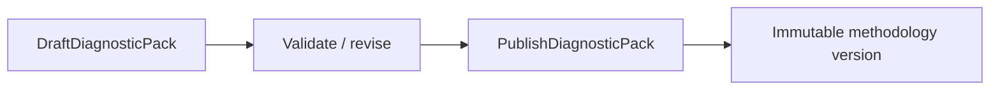
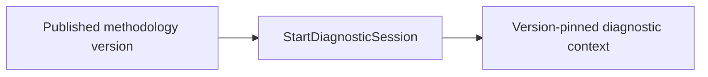
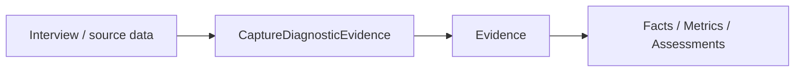
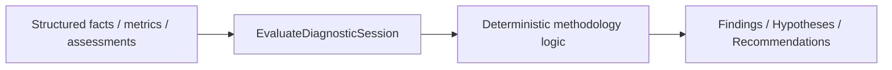
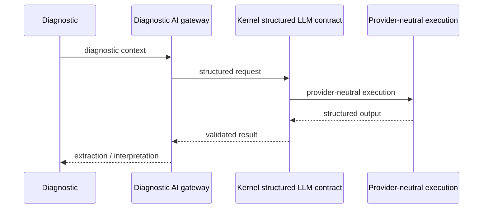
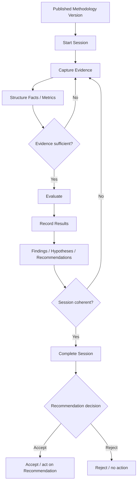

# Diagnostic Session → Recommendation

## Business goal

Провести відтворювану бізнес-діагностику, де кожен висновок можна простежити до methodology version та evidence, а AI допомагає структурувати дані, але не замінює deterministic evaluation.

## Actors

- methodology author;
- diagnostic operator / interviewer;
- respondent;
- Diagnostic AI boundary;
- deterministic evaluation engine;
- reviewer / decision maker.

## Preparation lifecycle

До початку session methodology проходить окремий lifecycle.



Session має бути pinned до конкретної published version, а не до mutable `latest`.

## Session trigger



Старт створює version-pinned diagnostic context для target, який діагностується.

## Evidence capture



Evidence є первинним traceability layer. Derived data без зрозумілого origin не повинні тихо перетворюватися на authoritative conclusions.

## Evaluation



LLM output не є прямим substitute для deterministic scoring.

## AI-assisted path



AI може допомогти:

- витягнути facts із тексту;
- нормалізувати відповіді;
- інтерпретувати qualitative evidence;
- підготувати structured input/report material.

AI не має автоматично створювати «істину» без evidence/validation boundary.

## Result lifecycle

Поточні generated application entry points включають:

- `RecordDiagnosticResult`;
- `CompleteDiagnosticSession`;
- `CancelDiagnosticSession`;
- `AcceptDiagnosticRecommendation`.

Повний список див. у [Application Use Cases](../12-reference/application-use-cases.md).

## Workflow



`process_state: as-is` фіксує реальний current Diagnostic process. Окремі human review/decision steps не трактуються як автоматизовані лише через те, що навколо них уже є runtime module.

## Decision points

- methodology version valid/published?
- evidence sufficient?
- confidence/coverage thresholds met?
- evaluation can produce score/finding?
- recommendation traceable to upstream evidence?
- session ready to complete?
- recommendation accepted?

## Failure paths

- draft/unpublished methodology → session start rejected;
- insufficient evidence → evaluation blocked або confidence reduced;
- dangling evidence reference → derived record rejected;
- LLM/schema failure → AI step fails without fabricating deterministic result;
- concurrent write conflict → persistence conflict handling;
- cancelled session → no pretend-success completion.

## Invariants

1. Published methodology version is reproducible.
2. Session is pinned to a version.
3. Derived results remain traceable to evidence/upstream records.
4. Deterministic scoring consumes structured data.
5. LLM transport belongs to Kernel/Infrastructure, prompts/interpretation belong to Diagnostic.
6. Diagnostic does not copy Sales/Finance/HR domain models into itself.
7. Completion freezes a coherent diagnostic result, not an arbitrary snapshot of half-processed input.

## Runtime boundary

Current Diagnostic `0.6.1` має runtime module service `diagnosticDomainModule`, API route contribution, `diagnosticActionOutcomeHandler`, Web navigation та Diagnostic migration contribution.

Це означає, що стара теза про «partial runtime integration без runtime module» більше не є правдою і вилучена з workflow.

## UI surfaces

Workflow проявляється через Diagnostic interview/session surfaces, reporting/recommendation views та runtime action outcome loop.

UI не є source of truth для methodology/evaluation rules.

## Code map

```text
app/Domains/Diagnostic/Methodology
app/Domains/Diagnostic/Application/UseCase
app/Domains/Diagnostic/Interview
app/Domains/Diagnostic/Evaluation
app/Domains/Diagnostic/AI
app/Domains/Diagnostic/Report
app/Domains/Diagnostic/Infrastructure
app/Domains/Diagnostic/Bootstrap/DiagnosticDomainModule.php
app/Domains/Diagnostic/module.php
```
