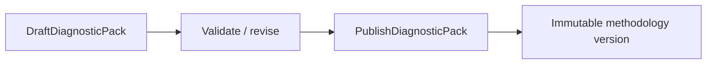
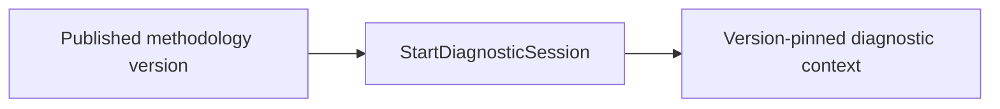
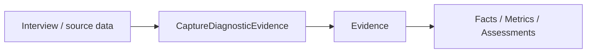
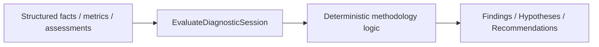
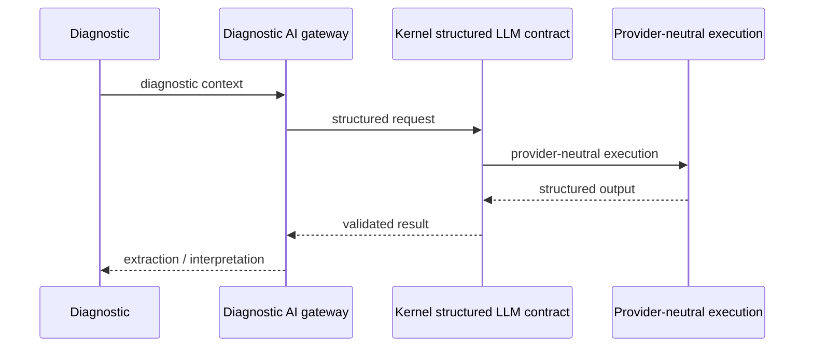

# Diagnostic Session → Recommendation

## Бізнес-мета

Провести відтворювану бізнес-діагностику, де кожний висновок можна простежити до конкретної версії methodology та evidence, а AI допомагає структурувати й інтерпретувати дані, але не підміняє deterministic evaluation.

## Учасники

- автор методології;
- diagnostic operator або interviewer;
- respondent;
- Diagnostic AI boundary;
- deterministic evaluation engine;
- reviewer або decision maker.

## Підготовка методології

До початку session methodology проходить окремий lifecycle.



Session має бути прив’язана до конкретної published version, а не до mutable `latest`.

## Тригер Session



Старт створює diagnostic context, прив’язаний до точної версії методології та target, який діагностується.

## Збирання Evidence



Evidence є первинним traceability layer. Derived data без зрозумілого походження не повинні непомітно перетворюватися на authoritative conclusions.

## Evaluation



LLM output не є прямою заміною deterministic scoring.

## AI-assisted шлях



AI може допомагати:

- витягувати facts із тексту;
- нормалізувати відповіді;
- інтерпретувати qualitative evidence;
- готувати structured input і матеріал для report.

AI не створює канонічну «істину» без evidence та validation boundary.

## Результати Session

Поточні generated application entry points включають:

- `RecordDiagnosticResult`;
- `CompleteDiagnosticSession`;
- `CancelDiagnosticSession`;
- `AcceptDiagnosticRecommendation`.

Повний список: [Application Use Cases](../12-reference/application-use-cases.md).

## Процес

<ProcessDiagram process-id="diagnostic.session-to-recommendation" />

Основний бізнес-потік є derived view із [Business Process Registry](../12-reference/business-processes.md). `steps` та `edges` не дублюються вручну.

`process_state: as-is` фіксує реальний поточний Diagnostic process. Людські review/decision steps не вважаються автоматизованими лише тому, що навколо них уже існує runtime module.

## Представлення відповідальності

<ProcessDiagram process-id="diagnostic.session-to-recommendation" view="ownership" direction="LR" />

Проєкція відділяє автора методології, оператора, deterministic evaluation engine і decision maker. AI boundary є учасником процесу, але не отримує ownership над deterministic evaluation.

## Представлення можливостей

<ProcessDiagram process-id="diagnostic.session-to-recommendation" view="capability" direction="LR" />

Проєкція навмисно показує capability gap: Diagnostic має реальний source-verified workflow, але module manifest ще не декларує semantic business capabilities для methodology, session, evidence, evaluation і recommendation. Існування runtime не підміняє capability model.

## Точки рішень

- чи methodology version валідна й published;
- чи достатньо evidence;
- чи виконані thresholds coverage/confidence;
- чи evaluation може сформувати score або finding;
- чи recommendation простежується до upstream evidence;
- чи session готова до завершення;
- чи recommendation прийнята.

## Шляхи помилок

- draft або unpublished methodology → запуск session відхиляється;
- insufficient evidence → evaluation блокується або confidence знижується;
- dangling evidence reference → derived record відхиляється;
- LLM/schema failure → AI-крок завершується помилкою без вигадування deterministic result;
- concurrent write conflict → застосовується persistence conflict handling;
- cancelled session → не може завершитися як успішна.

## Інваріанти

1. Published methodology version має бути відтворюваною.
2. Session прив’язана до конкретної версії.
3. Derived results простежуються до evidence та upstream records.
4. Deterministic scoring споживає структуровані дані.
5. LLM transport належить Kernel/Infrastructure, prompts та interpretation належать Diagnostic.
6. Diagnostic не копіює Sales, Finance або HR domain models у власне ядро.
7. Завершення фіксує цілісний diagnostic result, а не випадковий snapshot частково оброблених даних.

## Межа runtime

Diagnostic `0.6.1` має runtime module service `diagnosticDomainModule`, API route contribution, `diagnosticActionOutcomeHandler`, Web navigation та Diagnostic migration contribution.

Тому стара модель «partial runtime integration без runtime module» більше не є актуальною.

## Інтерфейсні поверхні

Процес проявляється через Diagnostic interview/session surfaces, reporting/recommendation views та runtime action outcome loop.

UI не є source of truth для methodology або evaluation rules.

## Карта коду

```text
app/Domains/Diagnostic/Methodology
app/Domains/Diagnostic/Application/UseCase
app/Domains/Diagnostic/Interview
app/Domains/Diagnostic/Evaluation
app/Domains/Diagnostic/AI
app/Domains/Diagnostic/Report
app/Domains/Diagnostic/Infrastructure
app/Domains/Diagnostic/Bootstrap/DiagnosticDomainModule.php
app/Domains/Diagnostic/module.php
```
