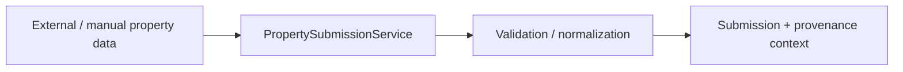
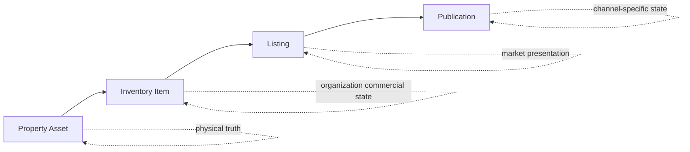
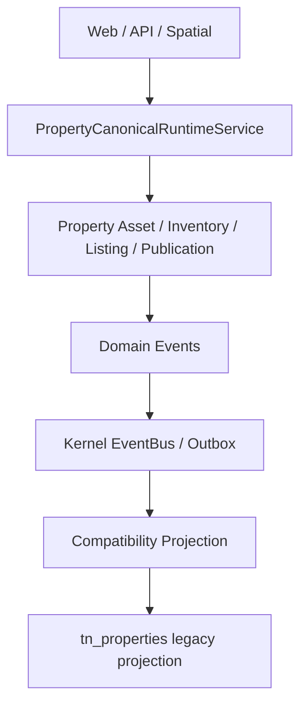

# Property Submission → Publication

## Бізнес-мета

Прийняти зовнішні або ручні дані про нерухомість, провести їх через intake та identity/provenance boundary, створити або зв’язати canonical Property Asset і, коли це потрібно бізнесу, провести актив через окремі комерційні шари `Inventory → Listing → Publication`.

## Учасники

- submitter або operator;
- moderator / reviewer;
- property manager;
- organization inventory owner;
- listing/content operator;
- publication channel adapter;
- Sales consumer через explicit Property boundary.

## Тригер / вхідні дані

Поточний процес починається з Property submission або іншого дозволеного Property write path.



Submission є intake boundary. Він не дорівнює canonical Property Asset.

## Фундаментальна межа

```text
Property Submission
≠ Property Asset
≠ Inventory Item
≠ Listing
≠ Publication
```

Це ключове розділення Property. Фізичний актив існує незалежно від того, чи продає його конкретна organization, як вона його представляє і на якому каналі публікує.

## Процес

<ProcessDiagram process-id="property.submission-to-publication" />

Основний бізнес-потік є derived view із [Business Process Registry](../12-reference/business-processes.md). `steps` та `edges` не дублюються вручну.

Схема описує бізнес-процес поверх поточної Property model і не стверджує, що кожен transition реалізовано окремим `Application/UseCase` class.

## Представлення відповідальності

<ProcessDiagram process-id="property.submission-to-publication" view="ownership" direction="LR" />

Проєкція показує відповідального actor для кожного канонічного кроку, не змішуючи фізичний Asset, commercial state, presentation і channel delivery в одну сутність.

## Представлення можливостей

<ProcessDiagram process-id="property.submission-to-publication" view="capability" direction="LR" />

Усі основні кроки мають явні Property capabilities: intake, identity review, registry, inventory, listing і publication.

## Канонічна модель



- **Property Asset** — фізична нерухомість та її canonical identity/structure;
- **Inventory Item** — комерційний стан активу для конкретної organization;
- **Listing** — ринкове представлення пропозиції;
- **Publication** — стан і lifecycle публікації на конкретному каналі.

Квартира не стає фізично `SOLD`. `SOLD` є commercial state Inventory.

## Прикладні точки входу

[Application Use Cases](../12-reference/application-use-cases.md) зараз фіксує, зокрема:

- `PropertySubmissionService`;
- `PropertyModerationService`.

Property має також canonical runtime services і commands поза вузькою convention `Application/UseCase`, тому generated use-case index не є повним описом runtime.

Див. [Property Domain Overview](../04-domains/property/overview.md), [Commands](../12-reference/commands.md) та [Module & Capabilities](../12-reference/module-capabilities.md).

## Точки рішень

- чи валідний submission;
- чи достатньо визначено source/provenance;
- чи дані належать існуючому Asset;
- чи identity потребує review;
- чи актив входить в Inventory конкретної organization;
- чи потрібен Listing;
- чи Listing готовий до Publication;
- чи channel operation дозволена й успішна.

## Межа runtime

Канонічний write path:



`tn_properties` не є canonical source of Property state.

## Взаємодія із Sales

Sales споживає Property через explicit contracts/read surfaces. Sales володіє попитом, pipeline та deal process; Property не переносить deal ownership у Asset або Inventory лише тому, що актив продається.

## Шляхи помилок

- invalid submission → validation failure;
- unresolved identity → review/conflict path, а не silent duplicate Asset;
- media/storage failure → application/infrastructure failure;
- forbidden commercial transition → Domain/governance rejection;
- publication/channel failure → retry/sync/audit без фальшивого published state;
- persistence failure → операція не повинна частково виглядати успішною;
- відсутній cross-domain contract → consumer не обходить boundary прямим SQL.

## Інваріанти

1. Submission lifecycle не тотожний Property Asset lifecycle.
2. Property Asset, Inventory, Listing і Publication мають різний зміст і ownership.
3. Physical asset identity не визначається commercial status.
4. Cross-domain access проходить через explicit contracts.
5. External network/channel vocabulary не стає canonical Property vocabulary автоматично.
6. Canonical write path не повертається до `tn_properties` як source of truth.
7. Business Events належать Property, generic delivery — Kernel/Infrastructure.

## Інтерфейсні поверхні

Процес проявляється через Property Workspace, public Property surfaces, catalogue/presentation, moderation/intake surfaces та external publication integrations.

UI може ініціювати operations, але не володіє identity, commercial lifecycle або publication rules.

## Карта коду

```text
app/Domains/Property/Model
app/Domains/Property/Application/Contract
app/Domains/Property/Application/UseCase
app/Domains/Property/Application/Service
app/Domains/Property/Infrastructure
app/Domains/Property/Bootstrap/PropertyDomainModule.php
app/Domains/Property/module.php
```
