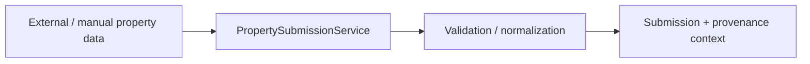
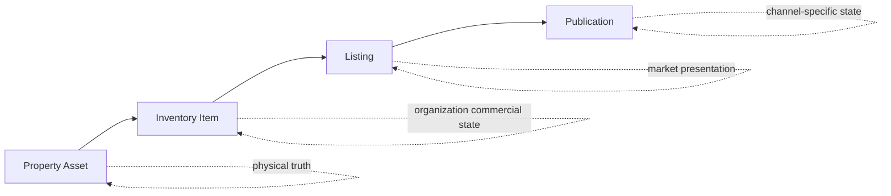
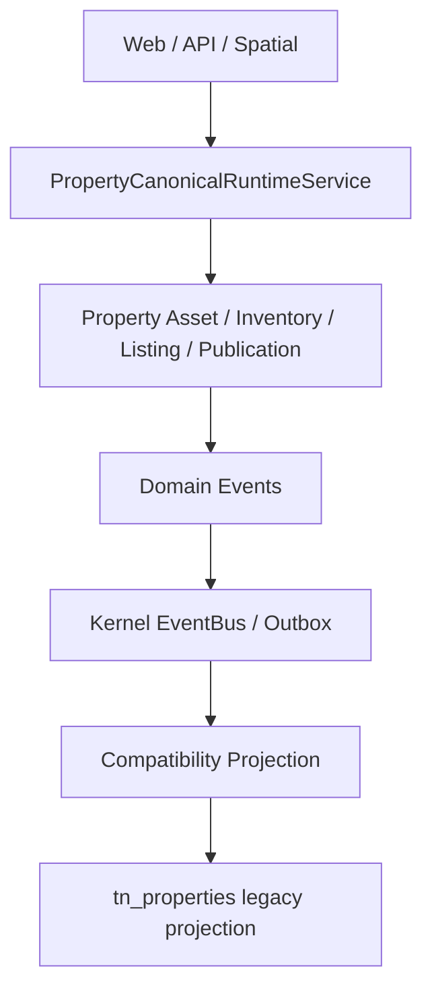

# Property Submission → Publication

## Business goal

Прийняти зовнішні або ручні дані про нерухомість, провести їх через intake та identity/provenance boundary, створити або зв'язати canonical Property Asset і, коли це потрібно бізнесу, провести актив через окремі commercial layers Inventory → Listing → Publication.

## Actors

- submitter / operator;
- moderator / reviewer;
- property manager;
- organization inventory owner;
- listing/content operator;
- publication channel adapter;
- Sales consumer через explicit Property boundary.

## Trigger / input

AS-IS процес починається із property submission або іншого дозволеного Property write path.



Submission є intake boundary. Він не дорівнює canonical Property Asset.

## Fundamental boundary

```text
Property Submission
≠ Property Asset
≠ Inventory Item
≠ Listing
≠ Publication
```

Це головна business separation Property V0.12. Фізичний актив існує незалежно від того, чи продає його конкретна організація, як вона його рекламує і на якому каналі публікує.

## Workflow

<ProcessDiagram process-id="property.submission-to-publication" />

Основний business flow є derived view із [Business Process Registry](../12-reference/business-processes.md). `steps` та `edges` не дублюються вручну на цій сторінці.

Ця схема описує business flow поверх current Property model. Вона не означає, що кожен transition реалізований окремим `Application/UseCase` class.

## Canonical model



- **Property Asset** — фізична нерухомість та її canonical identity/structure;
- **Inventory Item** — комерційний стан активу для конкретної organization;
- **Listing** — ринкова презентація пропозиції;
- **Publication** — channel-specific delivery/lifecycle listing.

Квартира не стає фізично `SOLD`. `SOLD` є commercial state Inventory.

## Application entry points

Generated [Application Use Cases](../12-reference/application-use-cases.md) наразі фіксує explicit `Application/UseCase` entry points:

- `PropertySubmissionService`;
- `PropertyModerationService`.

Property V0.12 також має canonical runtime, commands/services і capability contributions поза вузькою `Application/UseCase` directory convention. Тому generated use-case index не використовується як повний опис усього Property runtime.

Див. також [Property Domain Overview](../04-domains/property/overview.md), [Commands](../12-reference/commands.md) та [Module & Capabilities](../12-reference/module-capabilities.md).

## Decision points

- чи submission валідний;
- чи source/provenance достатньо визначений;
- чи дані належать існуючому Asset;
- чи identity потребує review;
- чи актив має бути включений в inventory конкретної organization;
- чи потрібна Listing presentation;
- чи Listing готовий до publication;
- чи channel operation дозволена і успішна.

## Runtime boundary

Current Property `0.12.0` має canonical runtime module service та authoritative write path.



`tn_properties` не є canonical source of Property state.

## Sales interaction

Sales споживає Property через explicit contracts/read surfaces. Sales володіє попитом, pipeline і deal process; Property не переносить deal ownership у Asset/Inventory тільки тому, що актив продається.

## Failure paths

- invalid submission → validation failure;
- unresolved identity → review/conflict path, а не silent duplicate Asset;
- media/storage failure → explicit application/infrastructure failure;
- forbidden commercial transition → domain/governance rejection;
- publication/channel failure → retry/sync/audit path без фальшивого published state;
- persistence failure → operation не повинна частково прикидатися успішною;
- missing cross-domain contract → consumer не обходить boundary прямим SQL.

## Invariants

1. Submission lifecycle не тотожний Property Asset lifecycle.
2. Property Asset, Inventory, Listing і Publication мають різне ownership/meaning.
3. Physical asset identity не визначається commercial status.
4. Cross-domain access проходить explicit contracts.
5. External network/channel vocabulary не стає canonical Property vocabulary автоматично.
6. Canonical write path не повертається до `tn_properties` як source of truth.
7. Business Events належать Property, generic delivery — Kernel/Infrastructure.

## UI surfaces

Workflow проявляється через Property Workspace, public Property surfaces, catalogue/presentation, moderation/intake surfaces та external publication integrations.

UI може ініціювати operations, але не володіє identity, commercial lifecycle чи publication rules.

## Code map

```text
app/Domains/Property/Model
app/Domains/Property/Application/Contract
app/Domains/Property/Application/UseCase
app/Domains/Property/Application/Service
app/Domains/Property/Infrastructure
app/Domains/Property/Bootstrap/PropertyDomainModule.php
app/Domains/Property/module.php
```
