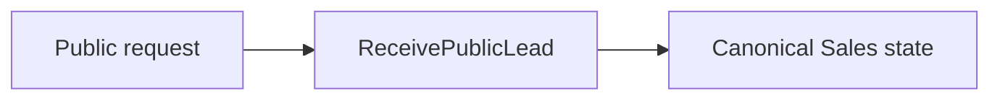
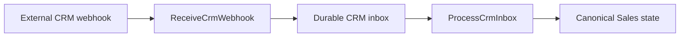
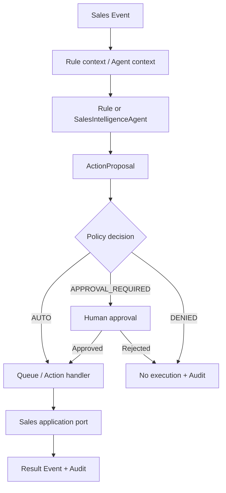

# Sales Lead → Managed Case

## Business goal

Перетворити inbound demand на керований Sales process із власником, pipeline state, next action, history та контрольованою automation.

## Actors

- client / external source;
- salesperson;
- manager;
- Sales automation;
- external CRM adapter.

## Triggers

AS-IS є два основні intake paths.

### Public intake



### CRM inbound



Provider payload перекладається на adapter boundary і не стає внутрішньою domain model напряму.

## Core entities / concepts

```text
Person relationship
≠ Lead
≠ ClientCase / Deal
```

Також workflow використовує PipelineStage, statuses, priority, assignment, activity, follow-up та property match.

## Canonical application entry points

Generated reference фіксує:

- `ReceivePublicLead`;
- `ReceiveCrmWebhook`;
- `ProcessCrmInbox`;
- `AssignDealOwner`;
- `ChangeDealStage`;
- `ScheduleDealFollowup`;
- `CompleteSalesCall`.

Повний актуальний список: [Application Use Cases](../12-reference/application-use-cases.md).

## Workflow

<ProcessDiagram process-id="sales.lead-to-managed-case" />

Основний business flow є derived view із [Business Process Registry](../12-reference/business-processes.md). `steps` та `edges` не дублюються вручну на цій сторінці.

`process_state: as-is` означає, що схема описує реальний поточний процес, але не стверджує, що кожен human/operational step уже machine-enforced COS runtime.

## Ownership view

<ProcessDiagram process-id="sales.lead-to-managed-case" view="ownership" direction="LR" />

Ownership view групує ті самі registry steps за відповідальним actor. Він не створює другого workflow і не переносить Domain ownership у UI або adapter layer.

## Capability view

<ProcessDiagram process-id="sales.lead-to-managed-case" view="capability" direction="LR" />

Capability view навмисно показує semantic gap. Sales runtime і evidence вже існують, але current module capability vocabulary переважно описує workspace/admin authority, а не бізнес-функції lead intake, stage execution, follow-up та outcome recording. V0.15 не маскує цю різницю випадковим permission mapping.

## Events

Sales володіє business events навколо lead, client case/deal, stage, calls, follow-up та action outcomes.

Canonical event strings див. у [Event Types](../12-reference/event-types.md), а не в ручному списку на цій сторінці.

State change + Event + Outbox мають залишатися узгодженими там, де downstream automation залежить від події.

## Automation loop



Agent не має direct mutation authority.

## Decision points

Ключові рішення workflow:

- чи intake валідний;
- чи це create або update;
- хто owner;
- який pipeline/stage;
- який next action;
- чи transition дозволений;
- чи automation action можна виконати автоматично;
- чи потрібен human approval.

## Read side

Operational UI повинен читати dedicated read models/projections, а не використовувати write repository як універсальний data source.

Це дозволяє окремо оптимізувати workspace, history, funnel та management views.

## Failure paths

- malformed provider payload → adapter/intake failure;
- duplicate delivery → idempotent handling;
- forbidden transition → domain/governance rejection;
- external side-effect failure → retry/audit path;
- policy deny → action не виконується;
- approval required → execution чекає decision.

## Invariants

1. Усе tenant-scoped.
2. External vocabulary не стає canonical vocabulary автоматично.
3. Pipeline transition проходить Sales governance.
4. Automation handler не повинен перетворюватися на SQL script.
5. Agent лише пропонує дію.
6. External side effects мають бути idempotent.
7. Business Event належить Sales, а не Kernel.

## UI surfaces

Workflow проявляється через Sales workspace, operational views, director/admin surfaces та інтеграційні delivery channels.

UI не володіє pipeline rules; він лише ініціює або відображає domain operations.

## Code map

```text
app/Domains/Sales/Model
app/Domains/Sales/Application/UseCase
app/Domains/Sales/Application/DTO
app/Domains/Sales/Automation
app/Domains/Sales/Infrastructure
app/Domains/Sales/Bootstrap/SalesDomainModule.php
app/Domains/Sales/module.php
```
