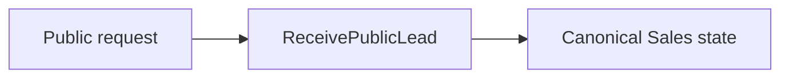
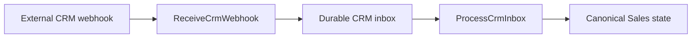
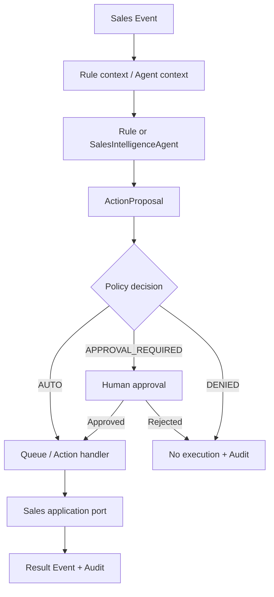

# Sales Lead → Managed Case

## Бізнес-мета

Перетворити вхідний попит на керований Sales process із відповідальним, станом pipeline, наступною дією, історією та контрольованою автоматизацією.

## Учасники

- клієнт або зовнішнє джерело;
- менеджер продажу;
- керівник;
- Sales automation;
- adapter зовнішньої CRM.

## Тригери

Поточний процес має два основні шляхи приймання.

### Публічна заявка



### Вхід із CRM



Payload зовнішнього provider перекладається на adapter boundary і не стає внутрішньою Domain model напряму.

## Основні сутності

```text
Person relationship
≠ Lead
≠ ClientCase / Deal
```

Процес також використовує `PipelineStage`, status, priority, assignment, activity, follow-up та property match.

## Прикладні точки входу

Generated reference фіксує, зокрема:

- `ReceivePublicLead`;
- `ReceiveCrmWebhook`;
- `ProcessCrmInbox`;
- `AssignDealOwner`;
- `ChangeDealStage`;
- `ScheduleDealFollowup`;
- `CompleteSalesCall`.

Актуальний список: [Application Use Cases](../12-reference/application-use-cases.md).

## Процес

<ProcessDiagram process-id="sales.lead-to-managed-case" />

Основний бізнес-потік є derived view із [Business Process Registry](../12-reference/business-processes.md). `steps` та `edges` не дублюються вручну.

`process_state: as-is` означає, що схема описує реальний поточний процес, але не стверджує, що кожний людський або операційний крок уже machine-enforced у COS runtime.

## Представлення відповідальності

<ProcessDiagram process-id="sales.lead-to-managed-case" view="ownership" direction="LR" />

Це представлення групує ті самі кроки Process Registry за відповідальним actor і не створює другого workflow.

## Представлення можливостей

<ProcessDiagram process-id="sales.lead-to-managed-case" view="capability" direction="LR" />

Представлення навмисно показує semantic gaps. Sales runtime уже існує, але поточний module capability vocabulary досі сильніше описує workspace/admin authority, ніж бізнесові можливості intake, stage execution, follow-up та outcome recording. Такі прогалини фіксуються явно, а не маскуються випадковими permissions.

## Події

Sales володіє бізнесовими Events навколо Lead, Client Case/Deal, stage, calls, follow-up та action outcomes.

Канонічні event strings дивіться в [Event Types](../12-reference/event-types.md).

State change + Event + Outbox мають залишатися узгодженими там, де downstream automation залежить від події.

## Цикл автоматизації



Agent не має прямого права на мутацію.

## Точки рішень

- чи валідний intake;
- створити новий запис чи оновити наявний;
- хто є owner;
- який pipeline/stage;
- яка наступна дія;
- чи дозволений transition;
- чи можна виконати automation Action автоматично;
- чи потрібне людське погодження.

## Модель читання

Операційний UI має читати dedicated read models/projections, а не використовувати write repository як універсальне джерело даних.

## Шляхи помилок

- malformed provider payload → помилка adapter/intake;
- duplicate delivery → ідемпотентна обробка;
- forbidden transition → Domain/governance rejection;
- external side-effect failure → retry/audit path;
- Policy deny → Action не виконується;
- Approval required → виконання чекає рішення.

## Інваріанти

1. Усі операції мають tenant scope.
2. External vocabulary не стає canonical vocabulary автоматично.
3. Pipeline transition проходить Sales governance.
4. Automation handler не перетворюється на SQL script.
5. Agent лише пропонує Action.
6. External side effects мають бути ідемпотентними.
7. Business Event належить Sales, а не Kernel.

## Інтерфейсні поверхні

Процес проявляється через Sales workspace, operational views, director/admin surfaces та integration delivery channels.

UI ініціює або відображає Domain operations, але не володіє pipeline rules.

## Карта коду

```text
app/Domains/Sales/Model
app/Domains/Sales/Application/UseCase
app/Domains/Sales/Application/DTO
app/Domains/Sales/Automation
app/Domains/Sales/Infrastructure
app/Domains/Sales/Bootstrap/SalesDomainModule.php
app/Domains/Sales/module.php
```
