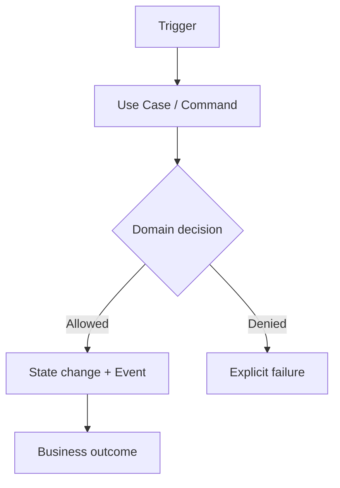

# Adding a Workflow

Workflow починається з business goal, а не з нового Service class.

## 1. Define business contract

Зафіксуйте:

- business goal;
- actors;
- trigger/input;
- expected output/outcome;
- decision points;
- failure paths.

Одразу визначте `process_state`:

- `as-is` — поточний реальний процес;
- `to-be` — цільовий процес;
- `runtime-verified` — critical transitions мають executable mapping у current `main`.

## 2. Draw the business flow

Канонічний workflow має Mermaid diagram. Спочатку показуйте business sequence, а не class graph.



Для actor/system interaction додавайте `sequenceDiagram`, для lifecycle однієї entity — `stateDiagram-v2`. Не змішуйте всі три питання в одну схему тільки тому, що Mermaid це дозволяє.

Повні conventions: [Business Process Modeling](../02-workflows/business-process-modeling.md).

## 3. Register the process

Кожен `workflow-v2` має matching JSON definition у:

```text
docs/.vitepress/processes/<process-id>.json
```

Definition фіксує:

- stable process ID;
- Domain owner;
- truth state;
- workflow page;
- trigger, actors та outcomes;
- steps і edges;
- critical steps;
- runtime mappings.

Runtime mapping types:

- `use_case` → generated Application Use Cases;
- `command` → generated Commands;
- `event` → generated Event Types;
- `source` → repository path + optional symbol.

Не вигадуйте event/command names «по сенсу». Якщо exact reference їх не знає, використовуйте реальний source mapping або спершу виправте executable catalogue.

## 4. Assign ownership

Для кожного state change визначте Domain owner. Cross-domain workflow може координувати кілька Domains, але не створює shared table, яким усі тихо володіють одночасно.

## 5. Map execution

Narrative, Mermaid flow і Process Registry зв'яжіть із executable boundaries:

```text
Trigger
  ↓
Use Case / Command
  ↓
Domain validation
  ↓
State change + Event
  ↓
Rule / Agent (optional)
  ↓
Policy / Approval
  ↓
External action (optional)
  ↓
Result / Audit
```

Не кожен step потребує окремого class. Документуйте meaningful business sequence, а exact executable inventory лишайте generated reference.

Для `runtime-verified` кожен critical step повинен мати хоча б один валідний runtime mapping.

## 6. Connect UI and code

Workflow page повинна вказати UI surfaces та Code map, щоб одна сторінка зв'язувала бізнес, UX, Runtime і implementation.

UI click не є business transition сам по собі. Diagram має називати business action/result, якщо UI лише доставляє intent.

## 7. Verify

Перевірте:

- happy path;
- forbidden transitions;
- duplicate delivery/idempotency;
- external failure/retry;
- tenant scope;
- auditability;
- відповідність Mermaid diagram narrative тексту;
- відповідність Registry topology реальному process;
- відповідність `process_state` фактичній зрілості process;
- існування всіх runtime mappings.

Запустіть:

```bash
npm run docs:generate
npm run docs:generate:check
npm run docs:check
npm run docs:build
```

`workflow-v2` не пройде check без `process_state`, Mermaid diagram і matching Process Registry definition.

## Canonical examples

- [Sales Lead → Managed Case](../02-workflows/sales-lead-to-managed-case.md)
- [Property Submission → Publication](../02-workflows/property-submission-to-publication.md)
- [Diagnostic Session → Recommendation](../02-workflows/diagnostic-session-to-recommendation.md)
- [Business Process Registry](../12-reference/business-processes.md)
