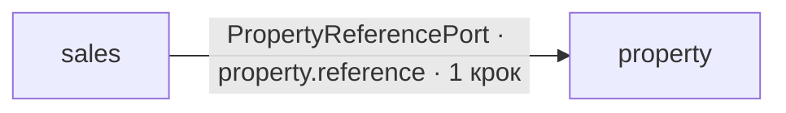

# Міждоменна топологія бізнес-процесів

Згенеровано з cross-domain кроків Process Registry schema v5+ і каталогу runtime evidence поточного checkout. Не редагуйте цю сторінку вручну.

Це представлення показує, **де бізнес-процес залишає свій Domain-власник, який канонічний contract дозволяє цей перехід, яка target capability використовується і як contract підтверджено evidence**.

## Підсумок

- **Перевірено канонічних процесів:** 4
- **Cross-domain процесів:** 1
- **Cross-domain кроків:** 1
- **Унікальних меж:** 1
- **Domains-учасників:** 2

## Топологія доменів

## Переходи процесів

| Процес | Крок | З Domain | До Domain | Contract | Target capability | Evidence |
| --- | --- | --- | --- | --- | --- | --- |
| [Sales Request → Property Match](../02-workflows/sales-request-to-property-match.md) | `resolve-property` · Resolve canonical Property presentation | `sales` | `property` | `Domains\Property\Contract\PropertyReferencePort` | `property.reference` | `runtime` |

## Агрегація меж

| Межа | Contract | Capability | Процесів | Кроків | Evidence |
| --- | --- | --- | ---: | ---: | --- |
| `sales → property` | `Domains\Property\Contract\PropertyReferencePort` | `property.reference` | 1 | 1 | `runtime` |

## Авторитетність і обмеження

- Process Registry володіє topology процесу і Domain, призначеним кожному кроку.
- Декларації module `cross_domain_contracts` володіють authority синхронних Domain boundaries.
- Runtime Evidence Resolver перевіряє, що Domain-власник процесу декларує `requires` contract до target Domain.
- Target capability залишається у власності target Domain; cross-domain перехід ніколи не створює shared state ownership.
- Цей довідник агрегує лише канонічні змодельовані переходи. Він не виводить hidden dependencies із SQL, imports, service locators або HTTP calls.
- Evidence strength описує структурне evidence поточного checkout. Це не observed production execution trace.
- Interactive documentation view є projection семантики Process Registry. Ця generated page є evidence-enriched reference.
