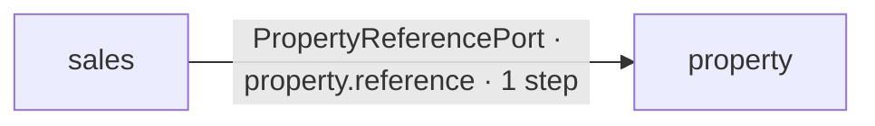

# Cross-Domain Process Topology

Generated from Process Registry schema v5+ cross-domain steps and the current-checkout runtime evidence catalogue. Do not edit this page manually.

This view answers **where a business process leaves its owning Domain, which canonical contract authorizes that hop, which target capability is used, and how the contract is evidenced**.

## Summary

- **Canonical processes scanned:** 4
- **Cross-domain processes:** 1
- **Cross-domain steps:** 1
- **Unique boundaries:** 1
- **Participating Domains:** 2

## Domain topology

## Process hops

| Process | Step | From | To | Contract | Target capability | Evidence |
| --- | --- | --- | --- | --- | --- | --- |
| [Sales Request → Property Match](../02-workflows/sales-request-to-property-match.md) | `resolve-property` · Resolve canonical Property presentation | `sales` | `property` | `Domains\Property\Contract\PropertyReferencePort` | `property.reference` | `runtime` |

## Boundary aggregation

| Boundary | Contract | Capability | Processes | Steps | Evidence |
| --- | --- | --- | ---: | ---: | --- |
| `sales → property` | `Domains\Property\Contract\PropertyReferencePort` | `property.reference` | 1 | 1 | `runtime` |

## Authority and limitations

- Process Registry owns process topology and the Domain assigned to each step.
- Module `cross_domain_contracts` declarations own synchronous Domain-boundary authority.
- Runtime Evidence Resolver verifies that a process-owner Domain declares a `requires` contract toward the target Domain.
- Target capability remains owned by the target Domain; a cross-domain hop never creates shared state ownership.
- This reference aggregates canonical modeled hops only. It does not infer hidden dependencies from SQL, imports, service locators or HTTP calls.
- Evidence strength describes structural current-checkout evidence. It is not an observed production execution trace.
- The interactive documentation view is a projection of Process Registry semantics. This generated page is the evidence-enriched reference.
